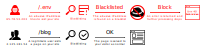
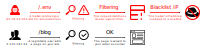

# IP Blacklist Plugin

The **IP Blacklist** Plugin is an extension for [Grav CMS](http://github.com/getgrav/grav). This plugin detects abusive requests and blocks abusive IPs. Additionally, it interfaces with [AbuseIPDB](https://www.abuseipdb.com/) for blacklisting and reporting.

> This plugin operates only within Grav, and is not a suitable replacement for a server firewall. It _may_ help reduce the impact of malicious bots on your site performance and bandwidth use, but it can only do so much. I'm not a security expert, so please don't take my word for anything.

Already familiar with Grav plugins? [__Skip to Usage__](#usage)!

---

## Installation

Installing the IP Blacklist plugin can be done in one of three ways: The admin method lets you quickly install the plugin via the Admin Plugin, The GPM (Grav Package Manager) installation method lets you do so with a simple terminal command, and the manual method lets you do so via a zip file.

### Admin Plugin (Preferred)

If you use the Admin Plugin, you can install the plugin directly by browsing the `Plugins`-menu and clicking on the `Add` button.

### GPM Installation

To install the plugin via the [GPM](http://learn.getgrav.org/advanced/grav-gpm), through your system's terminal (also called the command line), navigate to the root of your Grav-installation, and enter:

    bin/gpm install ip-blacklist

This will install the IP Blacklist plugin into your `/user/plugins`-directory within Grav. Its files can be found under `/your/site/grav/user/plugins/ip-blacklist`.

### Manual Installation

To install the plugin manually, download the zip-version of this repository and unzip it under `/your/site/grav/user/plugins`. Then rename the folder to `ip-blacklist`. You can find these files on [GitHub](https://github.com/aricooperdavis/grav-plugin-ip-blacklist) or via [GetGrav.org](http://getgrav.org/downloads/plugins#extras).

You should now have all the plugin files under

    /your/site/grav/user/plugins/ip-blacklist
	
> NOTE: This plugin is a modular component for Grav which may require other plugins to operate, please see its [blueprints.yaml-file on GitHub](https://github.com/aricooperdavis/grav-plugin-ip-blacklist/blob/master/blueprints.yaml).

---

## Configuration

Before configuring this plugin, you should copy the `user/plugins/ip-blacklist/ip-blacklist.yaml` to `user/config/plugins/ip-blacklist.yaml` and only edit that copy.

Here is the default configuration and an explanation of available options:

```yaml
enabled: true
# Enable the overall plugin
abuseipdb_key: null
# Your AbuseIPDB API key, required for fetching the AbuseIPDB blacklist or reporting abusive IPs to AbuseIPDB
logging: false
# Whether to log filtering/blacklisting actions to the Grav debug log (useful for troubleshooting custom filters)
enable_blacklisting: false
# Whether to block IPs that appear on the blacklist
sources:
# Which blacklists to search incoming IPs for
  local: false
  # The local blacklist updated by filtering (see below)
  abuseipdb: false
  # The AbuseIPDB blacklist (API Key required, see above)
enable_auto_cache: false
# Whether to use the Grav Scheduler to cache the AbuseIPDB blacklist daily (recommended)
enable_auto_clean: false
# Whether to use the Grav Scheduler to trim the size of the local blacklist daily
auto_clean_len: 10000
# The max length to which the local blacklist is trimmed by the Auto-Clean job
response: '400'
# The HTTP response code to return to blacklisted requests (options: 400, 403, 418, 503)
enable_reporting: false
# Whether to report abusive IPs to AbuseIPDB (API Key required, see above)
enable_filtering: false
# Whether to filter incoming requests in order to detect abuse and add the abusive IPs to the local blacklist. Overrides individual filter `enabled` attribute.
filters: |
# A list of regex patterns against which incoming request URIs are matched to detect abusive behaviour
  # Enter one regex pattern per line. Disable patterns with a comment (#). E.g.:
  # /path/to/exploit\.php/?action=hack
  /_ignition/execute-solution
  [...]
```

Note that if you use the Admin Plugin, a file with your configuration named ip-blacklist.yaml will be saved in the `user/config/plugins/`-folder once the configuration is saved in the Admin.

---

## Usage

This plugin has 2 main features that go hand in hand (but may be used independently):

* __Blacklisting__ (blocking) abusive IPs from your site
* __Filtering__ incoming requests to detect abusive ones

Both of these features integrate well with the Freemium [AbuseIPDB](https://www.abuseipdb.com) service; you can use their list of abusive IPs for blacklisting, or report abusive IPs detected by your filtering to their database.

### Blacklisting

Blacklisting works by checking the IP from which a request to your site originates against a list of known abusive IPs. If the IP is found on a blacklist then a plain HTTP response code is sent in return, and no further Grav processing occurs, saving you valuable server resources.



You can customise the response code sent to blacklisted IPs in the plugin configuration. The response codes available to you are:

| __Response Code__ | __Response Message__ |
| :- | :- |
| 400 | [Bad Request](https://developer.mozilla.org/en-US/docs/Web/HTTP/Status/400) |
| 403 (default) | [Forbidden](https://developer.mozilla.org/en-US/docs/Web/HTTP/Status/403) |
| 418 | [I'm a teapot](https://developer.mozilla.org/en-US/docs/Web/HTTP/Status/418) |
| 503 | [Service Unavailable](https://developer.mozilla.org/en-US/docs/Web/HTTP/Status/503) |

You can choose to use a local blacklist, or the AbuseIPDB blacklist, or both.

> __Note:__ Using the AbuseIPDB blacklist requires a free [AbuseIPDB API key](https://www.abuseipdb.com/account/api).

If you choose to use the AbuseIPDB blacklist then we recommend enabling the `Enable AbuseIPDB Auto-Cache` option in the plugin configuration to cache the AbuseIPDB blacklist in the background using the Grav Scheduler. This will prevent the first site visitor of the day having to wait for Grav to cache the AbuseIPDB blacklist before the page loads.

If you choose to use a local blacklist then you will need to add IPs to it yourself. This is easy if you enable the Filtering feature, which detects abusive requests to your site and adds the responsible IPs to your local blacklist.

You can also add IPs to your local blacklist using the IP Blacklist page in the Admin plugin. This is a nice graphical interface for the `local` table of the `/user/data/ip-blacklist/blacklists.sqlite` database.


If you wish to limit the size of the local blacklist you can enable the Auto-Clean Grav Scheduler job and set a maximum number of IP addresses in the plugin configuration. This job will run daily to trim the local blacklist to size and compress the database.

### Filtering
Filtering works by matching the [URI](https://en.wikipedia.org/wiki/Uniform_Resource_Identifier#Example_URIs) of incoming requests to your site against known abusive requests. This is done using regex pattern matching, and this plugin comes by default with a number of regex patterns to match known exploits.



Once an abusive request has been identified, the IP is recorded and added to the local blacklist. You may also choose for these abusive IPs to automatically be reported to AbuseIPDB.

> __Note:__ Reporting abusive IPs to AbuseIPDB requires _both_ a free [AbuseIPDB API key](https://www.abuseipdb.com/account/api) _and_ the elevated [Reporting Privilege](https://www.abuseipdb.com/account/request-reporting-privilege).

You can customise and extend the filters used to identify abusive requests via the plugin configuration. The `filters` config value is just a multiline string where each line is a regex filter. You can add, modify, and delete lines, or comment them out with a `#`. Be aware that all regex characters need escaping.

Be careful doing this - they're regex patterns and matching is performed against the entire URI, so you'll need to escape any regex symbols i.e. `?` should be `\?` and `.co.uk` should be `\.co\.uk`.


As these filters are stored in your plugin configuration they will not be automatically updated when the plugin is updated. As such a notification will be shown in the IP Blacklist admin interface when an update to the filters is available, which will enable you to automatically or manually install the new default filters.

---

## Stats

We have the plugin running on one of our sites, set up to report all abusive IPs to AbuseIPDB:

<a href="https://www.abuseipdb.com/user/102256" title="AbuseIPDB is an IP address blacklist for webmasters and sysadmins to report IP addresses engaging in abusive behavior on their networks">
	
</a>

---

## FAQs
__Q: Does IP blacklisting work if my site uses Cloudflare?__

A: Yes, when Cloudflare passes on a request to your server it adds the originating IP to the request headers. If these headers are present we check use these to check against the blacklist rather than the apparent IP of the request (which would be Cloudflare's own servers).

Note that Cloudflare may choose to serve a cached copy of your website to a blacklisted IP, and this cannot be prevented, but it will have no negative impact on your server.

__Q: When I use the AbuseIPDB blacklist my site sometimes takes ages to load!__

A: Enable the Grav Scheduler `AbuseIPDB Cache` task, which will cache the AbuseIPDB blacklist in the background.

Why is this needed? To keep your site loading quickly we cache as much of the AbuseIPDB blacklist as their API allows, and refresh this cache every 24 hours. If your site receives a request and the blacklist hasn't been cached yet, or the cache is out of date, then it may take a few seconds to fetch it from the AbuseIPDB servers.

__Q: Some IPs that are listed on AbuseIPDB are not being blacklisted!__

A: The AbuseIPDB API only allows us to fetch a blacklisting containing the IPs that they are most confident are abusive. As such, if the IP you're testing isn't in that top range then it may not be blocked. The number of IPs that the API allows us to cache depends on your AbuseIPDB account:

| __Standard__ | __Basic Subscription__ | __Premium Subscription__ |
| :- | :- | :- |
| 10,000 | 100,000 | 500,000 |

For the time being you may add abusive IPs to your local database manually, but we're working on a feature that allows IPs that aren't blacklisted to be checked retrospectively against the AbuseIPDB API `check` endpoint and added to our local blacklist if they're known to be abusive by AbuseIPDB - stay tuned!

<!-- You may wish to enable the `Check individual IPs` option in the plugin configuration. This checks non-blacklisted IPs individually against the AbuseIPDB API after the request has happened. If the IP is found to be blacklisted on AbuseIPDB then it is added to your local blacklist so that future requests can be intercepted.

Whilst this API endpoint will return details about any IP on the blacklist, it is limited to a certain number of requests per day. You can increase the number of requests per day that you may make by verifying that you are a webmaster, and even further by displaying a supporter badge on your site:

| __Basic Account__ | __Verified Webmaster__ | __Verified Supporter__ |
| :- | :- | :- |
| 1,000 | 3,000 | 5,000 |
 -->

__Q: Some IPs are getting blacklisted that are not abusive!__

A: We have no control over the AbuseIPDB blacklist, so if you believe that an IP has been added to it by mistake then you must request that it is taken down directly with AbuseIPDB (for which a free account is required).

If you are using the local blacklist then you can remove the IP from your blacklist in the IP Blacklist section of the Admin plugin. This is a nice graphical interface for the `local` table of the `/user/data/ip-blacklist/blacklists.sqlite` database.

__Q: Some of the filters are catching legitimate requests, whilst some abusive requests aren't being filtered at all!__

A: We try to ensure that the default filters shipped with the plugin cover a decent range of abusive requests but don't match common non-abusive URIs. You may need to tweak these filters a little for your particular setup.

You can modify the filters in the `filters` option of the plugin configuration (see above for details).

__Q: Help, I was testing the filters and have blacklisted my own IP!__

A: You silly goose! You'll have to remove your IP from the `local` table in the `/user/data/ip-blacklist/blacklists.sqlite` database file, because you will be locked out of the Admin plugin. Your IP is only blacklisted from your site, not your server, so you'll be able to log-in and make this change using ssh, SFTP, or cPanel.

If you aren't comfortable with manipulating the database then you can just delete the whole file and it'll be re-created (empty!) when needed.

__Q: The plugin doesn't work on my site!__

A: Some shared hosting providers are quite aggressive with their security practices. You can usually get in contact with them and ask them to relax some of their security measures for your user, but knowing which ones are responsible for breaking the plugin can be tricky.

<!--
Here is a table of some symptoms and causes that may be useful for identifying what's breaking the plugin:

| Symptom | Cause |
| :- | :- |
| The admin interface shows loading spinners. | ? |
-->

If you need help getting it fixed please [open an Issue](https://github.com/aricooperdavis/grav-plugin-ip-blacklist/issues) and we'll try to help. This will also allow us to modify the plugin to avoid these security measures, and we can add your fix to the documentation to help others.

---

## To Do

If you would like to help us develop this plugin then please consider starting with some of these projects that we've got on the go:

- [ ] Add lots more default filters!
- [ ] Disable reporting and AbuseIPDB blacklisting in the event of an unauthorised API request, to prevent repeated failures against the AbuseIPDB API.
- [ ] Allow cached AbuseIPDB blacklists to be customised based on query parameters to the `blacklist` API endpoint (`exceptCountries`, `limit`, and `confidenceMinimum`).
- [ ] Implement a buffer that the IPs of non-blacklisted requests are added to so that they may be checked retrospectively against the AbuseIPDB `check` API endpoint and added to the local blacklist if found to be abusive.
- [ ] Translations.
